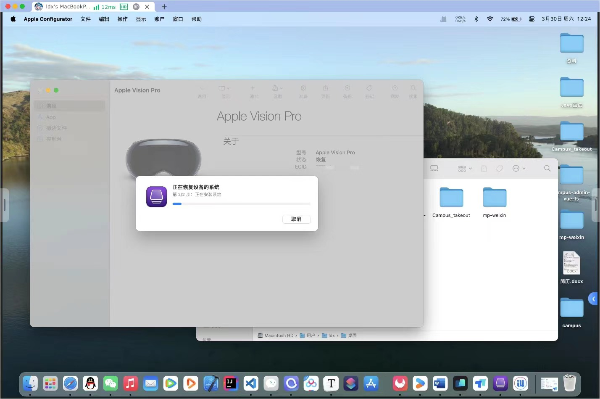

# **Apple Vision Pro** **刷机教程**

*How to install visionOS on Vision Pro with ipsw file?*

1. Put on the Apple Vision Pro and turn it on.

2. Go to Settings → Apple ID → Turn off the iCloud Activation Lock.
This is optional, but I recommend doing this to make the post-downgrade/post-upgrade setup quicker.

3. Now, take off the headset. Using the ejector toolthat came with the Developer Strap, detach theright audio strap of your Vision Pro → In the same slot, attach the Developer Strap by pressing it down. 

4. Use a USB-C cable to connect your Mac to the Developer Strap attached to your Vision Pro. You need to attach the USB-C cable to the port at the tip of the Developer Strap.

5. Attach the power cable of the battery pack to the left side of your Apple Vision Pro.

6. Quickly press and hold the top button on the Apple Vision Pro to enter recovery mode.
Press and hold till you see a Connect to Mac icon appear on the front display of the Apple Vision Pro.

7. Then, on your Mac, launch Apple Configurator → Double-click the Apple Vision Pro image.
If it’s your first time connecting the headset to your Mac, you’ll need to click Allow. 

8. Click Action from the Menu bar → Hold the Option Key → Then, select Restore.

   

   

9. When Finder opens, locate the visionOS IPSW restore image you downloaded → Click Restore.

   

10. On the front display of the Vision Pro, you’ll see an Apple logo followed by a progress bar. On your Mac, you’ll see a Restoring System on device progress bar.

    

    

    

    

    

    （avp进入恢复模式方法：拔电源然后接电源的时候，立马按住那个顶部右侧圆形的按键）

----

https://developer.apple.com/support/install-beta/#visionos-beta

https://www.igeeksblog.com/how-to-downgrade-visionos-on-apple-vision-pro/
