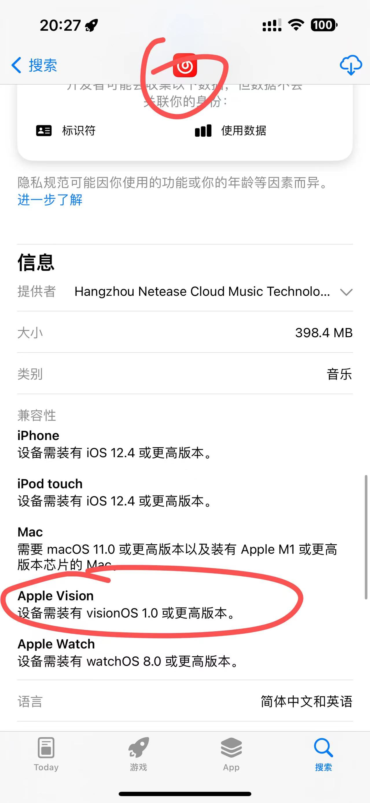
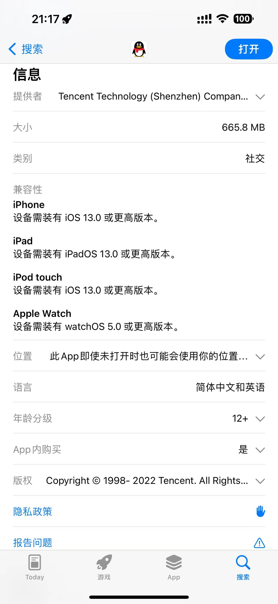

# Apple Vision Pro 侧载APP的详细教程

----

## IPA 下载站：

Decrypt.day

**https://t.me/py996** / **https://t.me/tkdashen**

## 其他ipa网站请看链接中内容：

https://lovejessychen.github.io/#ipa%E4%B8%8B%E8%BD%BD%E7%AB%99

## 预备知识：

1.Apple Watch、Apple Vision Pro、Apple TV、iPhone、iPad 他们的安装包和刷机格式都分别是ipa、ipsw，但是他们虽然都用同一个后缀名 但是包内容略有区别，即便他们系统都基于iOS，iOS继承自macOS（Darwin/BSD）,

2.由于目前是市面上有些软件（IPA）并没有导出直接兼容的vision app，也没为vision特地重新构筑的单独app，那么此类app，诸如QQ，YouTube，Spotify 等等，无法直接安装，无论通过哪种方式。除非解包魔改app

举个例子：1.网易云音乐 是兼容vision pro的，只是没有3D优化：

2.QQ （即时通讯软件），他没有直接兼容vision pro：

上述的两个例子，第一个软件可以直接安装，第二个软件 他不能直接安装，原因就在于 导出的时候没有选择xrOS平台的框架 就不能直接兼容，你强行安装 点击它就没有反应。（笔者尝试过的。）

---

---

## 1. 有线连接方案

## （需要额外购买Developer Strap for AVP）：

## 激活开发者模式：

1.Connect with Developer Strap and USB-C To USB-C to your Mac.

2.On Vision Pro -> Settings > General > Remote Devices.

3.On Mac -> Xcode -> Devices & Simulators -> Select the Vision Pro & enter the code.

4.On Mac -> Run a build targeted at your vision pro device which should now be a run destination (Developer mode setting wasn't visible till I did this), 

you will get an error saying developer mode is not enabled.

5.On Vision Pro -> Privacy & Security > Developer Mode.

### 准备工具：

1.**Developer Strap for AVP (Original Price: $299) & USB-C To USB-C 数据线**

2.Mac 电脑/Xcode(作为辅助)

3.Apple Configurator 2.17+（Appstore 直接下载） / iMazing 2.17.5+ （2.17.5 下载地址：https://pixeldrain.com/u/iiT7wJXW）

4.iTunse 12.6.5 (Win/或者虚拟机 不限架构，可以在win11 arm中 转译x64->arm64的形式支持arm64)

## 教程1（原版ipa，无需签名比较方便） ：

1. 激活开发者模式：https://developer.apple.com/documentation/xcode/enabling-developer-mode-on-a-device

   .jpg)

2. 安装连接件：拿掉遮光罩 和后边的绑带，然后看到右侧的一个小洞口，用取卡针轻按下洞口，将右侧的音频带 缓慢拉出，然后 把developer strap插口对准这个接口然后慢慢按下。（具体的一些图示教程可看内置说明书 非常详细，这里就不赘述了。）

3. usb-C的一头插入developer strap 另一头插入Mac电脑的接口，连接并在vision pro中信任此电脑。

4. Apple Configurator 2.17+，登录账号 下载兼容的ipa 直接安装，或者用iTunes 12.6.5.3 win的登录账号 下载ipa （方法2选一，个人推荐前边的。）

5. 打开imazing，选择vision pro，在下拉右侧的窗口 点击应用程序，把下载好的ipa拖入刚刚打开的应用程序窗口中 等待安装完成即可。

6. 安装完毕后，拔掉线缆USB-C To USB-C，即可直接打开APP（一般在兼容的apps文件夹中，按首字母排列的。和平常从AppStore下载的一样）！

## 教程2（砸壳ipa，需要自己签名，目前没有巨魔） ：

预备：可以使用免费Apple ID账户，这个账户 签名7天有效，过了7天需要重新签名；

使用苹果开发者付费账户，每年99美元，这个账户的有效期是一年。第二年需要重新签名。

砸壳ipa下载网站：Decrypt.day

正文：

1. *激活开发者模式*
2. *安装连接件：拿掉遮光罩 和后边的绑带，然后看到右侧的一个小洞口，用取卡针轻按下洞口，将右侧的音频带 缓慢拉出，然后 把developer strap插口对准这个接口然后慢慢按下。（具体的一些图示教程可看内置说明书 非常详细，这里就不赘述了。）*
3. usb-C的一头插入developer strap 另一头插入Mac电脑的接口，连接并在vision pro中信任此电脑。
4. 自签名可以用工具来签名 比如爱思助手(i4tools/3utools), 依次点击工具箱-ipa签名

，使用apple id签名，输入自己的账号&密码登录 即可（两步验证 自己弄好就可）。

5. 打开签名的ipa文件夹 ，同时也打开imazing，选择vision pro，在下拉右侧的窗口 点击应用程序，把签名好的ipa拖入刚刚打开的应用程序窗口中 等待安装完成即可。

6. 安装完毕后，拔掉线缆USB-C To USB-C，戴上vision pro，打开“设置”，点击“通用”，点击“VPN与设备管理”，再点击刚刚签名的“id邮箱” .r然后点击蓝色的“信任APP”，然后关闭设置，就可以在兼容的apps文件夹中，的第一页找到刚刚装的app，点击它打开就可使用了！

   .jpg)

   .jpg)

## ~~2.无线蓝牙连接方案 （不需要额外的连接线）：~~

----

### 准备工具：

1.Mac电脑

【tips: (1) 白苹果: MacBook、Mac Mini 等等（2）~~黑苹果: 前提是这台pc有蓝牙与无线模块 且正常驱动的（不推荐）~~】

**2.Xcode (装好vision pro的模拟器 以便连接xcode)**

## 激活开发者模式：

1.Connect to computer with Same wifi.

2.On Vision Pro -> Settings > General > Remote Devices.

3.On Mac -> Xcode -> Devices & Simulators -> Select the Vision Pro & enter the code.

4.On Mac -> Run a build targeted at your vision pro device which should now be a run destination (Developer mode setting wasn't visible till I did this), 

you will get an error saying developer mode is not enabled.

5.On Vision Pro -> Privacy & Security > Developer Mode.

