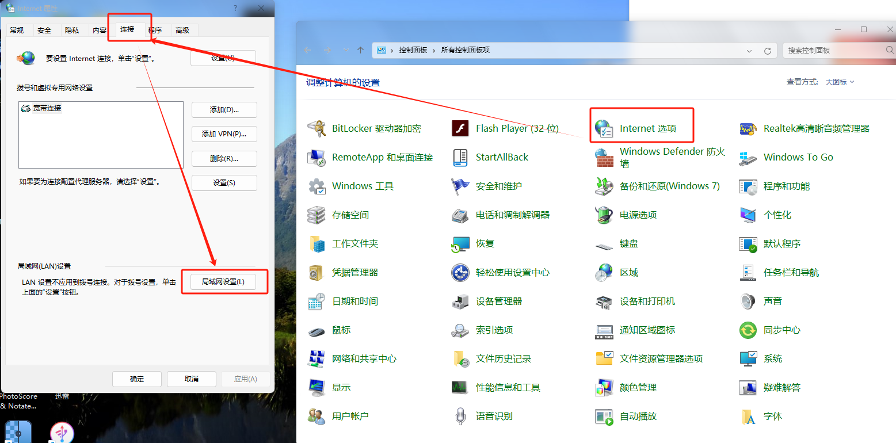
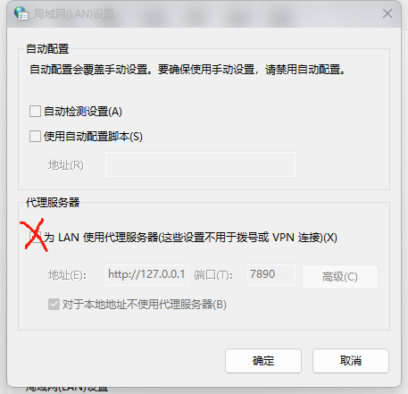
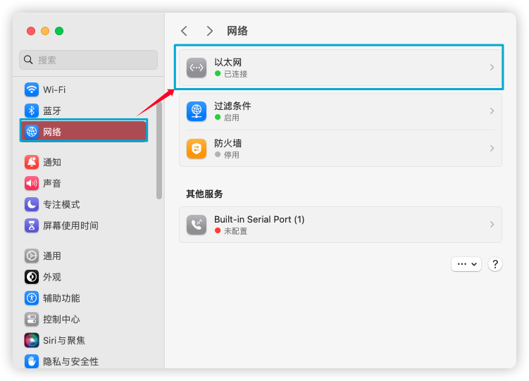
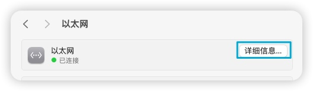
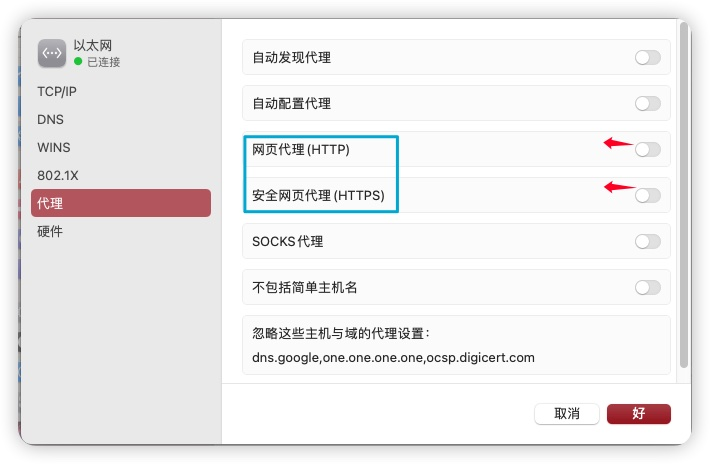

# Win&Mac关闭代理设置

Win&Mac Close Proxy Setting

 

## 1. Windows 关闭代理设置

1.打开“控制面板”，点击“Internet选项”，弹出的窗口中单击顶上的“连接”选项卡，再点击下方的“局域网设置”；

2.弹出的新窗口中   取消勾选 这个打叉的选项！！然后点击确定，确定，依次退出即可。

---

## 2. Mac 关闭代理设置

1.打开“系统设置“，点击网络，再点击右侧的以太网（或者wifi之类的你当前在使用的网络）；

2. 点击“详细信息”

3.弹出的窗口中点击左侧的“代理”，取消“网页代理（HTTP）”和“安全网页代理（HTTPS）”的打开状态，也就是从绿色变成灰色，即为关闭了代理设置，现在就可以正常的打开网页了！

